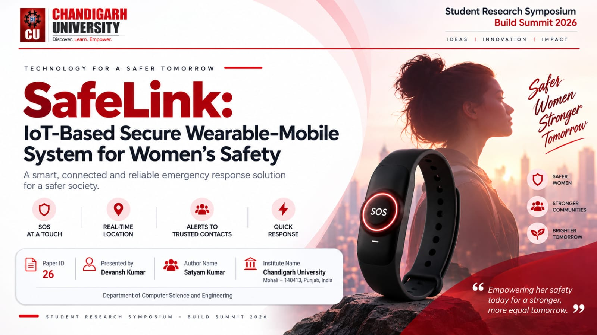
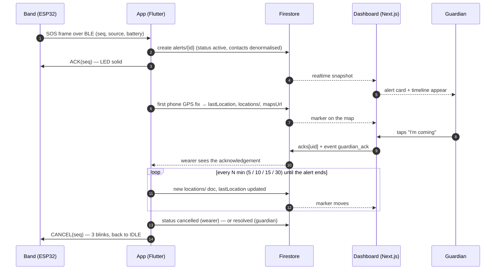
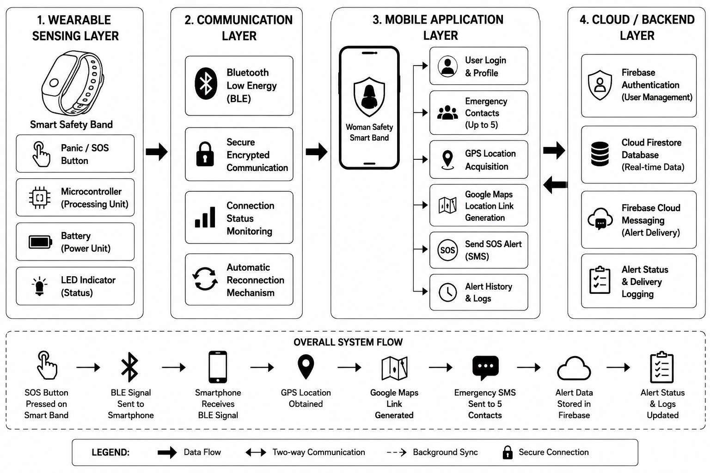

<p align="center">
  
</p>

<h1 align="center">SafeLink</h1>

<p align="center">
  <strong>Hold the band's button for two seconds. The people you trust see where you are — live.</strong>
</p>

<p align="center">
  
  
  
  
  
  
</p>

---

## What is SafeLink

SafeLink is a wrist band with a single SOS button, paired over Bluetooth Low Energy to an Android app, backed by Firebase. A two-second hold on the band creates an alert in Firestore; the wearer's trusted contacts — her *guardians* — open a web dashboard and see the alert, her position on a map, and a timeline, within seconds. They can tap **I'm coming**, and the wearer sees that acknowledgement on her phone. Everything runs on the Firebase free plan; there is no server to maintain.

It is the working prototype behind the paper *SafeLink: An IoT-Based Secure Wearable–Mobile System for Women's Safety* (Chandigarh University, Build Summit 2026). Measured in the paper: **98 %** reconnect success at 0–5 m · **1.2 s** BLE reconnect · **3.2 m** outdoor GPS error · **2.8 s** alert latency.

### The problem

In the moment that matters, the victim usually cannot take out a phone, unlock it and open an app. Wearables exist, but most of them fail silently:

| Failure mode | Why it fails | SafeLink's answer |
|---|---|---|
| Manual-only activation | Needs both hands and attention | One hold on a band; a discreet touch pad as a second trigger |
| Phone presence assumed | A press while the phone is out of range is simply lost | The band keeps the press (a never-reused sequence number) and re-sends it the moment the phone reconnects |
| Weak or no BLE security | Anyone can spoof or read the link | GATT service designed for bonded + encrypted mode (one flag in v0) |
| No receipt confirmation | The wearer never knows if help is on the way | App ACKs the band (LED goes solid); guardians acknowledge on the dashboard and the wearer sees it |

## How it works



The eight steps, as on the symposium deck:

1. **SOS button pressed** — hold ≥ 2 s on the push button or the touch pad
2. **BLE signal sent** — a 12-byte SOS frame with a persistent sequence number
3. **App receives signal** — and ACKs the band *before* doing anything else
4. **GPS position obtained** — phone GPS first; the band's optional NEO-6M as fallback
5. **Maps link generated** — `https://maps.google.com/?q=lat,lng`
6. **Alert reaches trusted contacts** — live on the dashboard (v0); SMS once a SIM is available
7. **Alert stored in Firestore** — with a location trail and an event timeline
8. **Status updated** — acknowledged by a guardian, cancelled by the wearer, or resolved

> **Honest note on v0:** alerts are delivered through the live web dashboard and the wearer's own app. The test phone has no SIM, so SMS to contacts is a later phase; contact phone numbers are already stored for it. There are no push notifications and no Cloud Functions in v0.

## Architecture

<p align="center">
  
</p>

| Layer | Responsibility | Built with |
|---|---|---|
| **1 · Wearable sensing** | SOS button + discreet touch pad, hold detection, LED feedback, press counter in flash, optional GPS, battery | ESP32 NodeMCU-32 · PBS-11B button · TTP223 · u-blox NEO-6M · TP4056 + 500 mAh LiPo |
| **2 · Communication** | Custom BLE GATT service, continuous advertising, auto-reconnect, re-delivery of a press made while disconnected, ACK / CANCEL commands | NimBLE-Arduino · service `5AFE1000-…` · standard Battery + Device Information services |
| **3 · Mobile app** | Pair the band, keep the link alive with the screen locked, create the alert, stream phone GPS every N minutes, cancel, history, settings | Flutter (Android 15/16) · foreground service · Firebase Auth + Firestore |
| **4 · Cloud** | Accounts, realtime alert store, rules-based access for guardians, static hosting for the dashboard | Firebase Spark: Auth · Firestore · Hosting — dashboard in Next.js App Router + Tailwind + Leaflet/OpenStreetMap |

## Hardware

Bill of materials (everything the team owns; no buzzer or vibration motor in v0, so feedback is LED-only):

| Part | Role |
|---|---|
| ESP32 NodeMCU-32 (38-pin, WROOM-32) | MCU + BLE |
| PBS-11B 12 mm momentary push button | SOS button |
| TTP223 capacitive touch module | discreet alternate SOS trigger |
| u-blox NEO-6M GPS (with EEPROM) | optional band-side GPS fallback |
| TP4056 Type-C 1 A charger + 3.7 V 500 mAh LiPo | power (≈ 6–10 h with BLE connected, no sleep) |
| Breadboard, M-F jumpers, berg strip, solder kit | assembly |
| Onboard LED (GPIO 2) | status feedback |

Wiring (ESP32 NodeMCU-32, 38-pin):

| Signal | ESP32 pin | Notes |
|---|---|---|
| SOS push button | GPIO 25 ↔ GND | `INPUT_PULLUP`, active LOW, 30 ms debounce, hold ≥ 2 s |
| TTP223 OUT | GPIO 26 | VCC → 3V3, GND → GND, active HIGH |
| Status LED | GPIO 2 (onboard) | optional external: GPIO 27 → 220 Ω → LED → GND |
| NEO-6M TX / RX | GPIO 16 / GPIO 17 | `Serial2` @ 9600; RX only needed to configure the module |
| Battery sense (optional) | GPIO 34 | BAT+ → 100 kΩ → GPIO 34 → 100 kΩ → GND |
| Power | TP4056 OUT+ → **VIN**, OUT− → GND | LiPo on B+/B−; never feed the cell into 3V3 |

Feature flags live in `firmware/safelink_band/config.h`: `SAFELINK_HAS_TOUCH`, `SAFELINK_HAS_GPS`, `SAFELINK_HAS_BATT_SENSE`, `SAFELINK_REQUIRE_ENC`. Power notes and safety: [`docs/hardware.md`](docs/hardware.md).

## Repository layout

```
safelink/
├── firmware/safelink_band/   Arduino sketch for the band: NimBLE GATT server, button/touch hold, LED patterns, NVS seq, optional GPS
├── app/                      Flutter Android app: auth, contacts, band pairing, SOS engine (BLE → Firestore → periodic location), history, settings
├── web/                      Next.js dashboard for guardians: landing, login, live alerts + map, alert detail — static export
├── firebase/                 Firestore security rules, composite indexes, Hosting config, rules tests
└── docs/                     The contracts every module is built against
    ├── decisions.md          Locked v0 decisions — read this first
    ├── ble-protocol.md       GATT layout, frames, commands, band state machine
    ├── firestore-schema.md   Collections, queries, rules intent, alert lifecycle
    ├── hardware.md           BOM, wiring, power notes
    ├── theme.md              Colours, type and motifs from the deck
    ├── build-plan.md         Phases and later ideas
    └── setup-firebase.md     Click-by-click Firebase project setup
```

## Quick start

| Module | Steps |
|---|---|
| **Firebase** | Follow [`docs/setup-firebase.md`](docs/setup-firebase.md): create the project (Spark), enable Email/Password auth, create Firestore in `asia-south1`, then `cd firebase && firebase use <project> && firebase deploy --only firestore`. |
| **Firmware** | Open `firmware/safelink_band/safelink_band.ino` in **Arduino IDE 2.x** → board **ESP32 Dev Module** → Library Manager: install **NimBLE-Arduino** and **TinyGPSPlus** → flash. Test with **nRF Connect**: connect to `SafeLink-XXXX`, subscribe to the SOS characteristic, hold the button. |
| **App** | `cd app && flutterfire configure && flutter run` on an Android 15/16 phone with Bluetooth and location on. |
| **Web** | `cd web && cp .env.example .env.local && npm install && npm run dev` → fill `.env.local` with the Firebase web config → <http://localhost:3000>. |
| **Deploy** | `cd web && npm run build`, then `cd ../firebase && firebase deploy --only firestore,hosting`. |

## Data model

Three collections, designed for direct client access (no backend, so data is denormalised instead of joined). Full shapes in [`docs/firestore-schema.md`](docs/firestore-schema.md).

- `users/{uid}` — profile (`displayName`, lower-case `email`, `phone`), `settings.locationIntervalMin` (5 / 10 / 15 / 30) and a `band` block the app keeps current (`deviceId`, `connected`, `batteryPct`, `lastSeenAt`).
- `users/{uid}/contacts/{id}` — up to five trusted contacts: `name`, `phone`, lower-case `email` (the guardian signs in with it), `priority`.
- `alerts/{id}` — top-level so guardians can query across owners: `ownerUid`, `status` (`active` → `cancelled` | `resolved`), `trigger`, `bandSeq`, denormalised `contactEmails` / `contacts`, `lastLocation`, `mapsUrl`, `acks` keyed by guardian uid.
- `alerts/{id}/locations/{loc}` — one document per fix (`lat`, `lng`, `accuracyM`, `at`, `source` phone | band); `alerts/{id}/events/{ev}` — the timeline (`sos_received`, `acked_band`, `location_fix`, `guardian_ack`, `cancelled`, `resolved`, …).
- Access: signed-in only. Owner: everything on her own data. Guardian (auth e-mail in `contactEmails`): read the alert and its subcollections, write `acks`, resolve. Nobody deletes alerts.
- Queries are backed by four composite indexes in [`firebase/firestore.indexes.json`](firebase/firestore.indexes.json); the rules and their tests live in [`firebase/`](firebase/README.md).

## BLE protocol

- The band advertises as `SafeLink-XXXX` with the 128-bit service `5AFE1000-0000-4000-8000-534146454C4B`; the app scans by service UUID.
- Characteristics: **SOS** (12 B, notify), **Status** (8 B, notify + 30 s heartbeat), **Command** (write), optional **GPS** (16 B), plus standard Battery Level and Device Information. All frames fit the default MTU.
- Each SOS frame carries a persistent, never-reused `seq`; the phone writes `ACK(seq)` first and `CANCEL(seq)` only from the app UI. `seq ≤ lastSeq` is a re-send, not a new alert.
- A press made while disconnected is re-sent as soon as the phone re-subscribes. v0 uses plain GATT; bonded + encrypted mode is `SAFELINK_REQUIRE_ENC 1`. Details: [`docs/ble-protocol.md`](docs/ble-protocol.md).

## Demo script

1. **Pair** — open the app on the phone, sign in as the wearer, *Pair band* → `SafeLink-XXXX`. The band LED blinks once every 3 s: connected. Lock the phone.
2. **Guardian online** — on a laptop, the guardian signs in to the dashboard with the e-mail the wearer added as a contact. Empty feed, band shown as connected.
3. **Hold SOS for 2 s** — the band LED blinks fast, then goes solid as the app ACKs.
4. **Alert appears** — within a few seconds the dashboard shows the red alert card, the map marker and the `sos_received` → `location_fix` timeline.
5. **Acknowledge, then close** — the guardian taps **I'm coming**; the wearer's app shows *Maa is coming*. Cancel from the app: the band blinks three times and returns to idle; the alert moves to history.

Rehearse on a phone hotspot with the laptop on the same network.

## Roadmap

| # | Phase | Deliverable | Done when |
|---|---|---|---|
| 0 | Contracts + skeleton | `docs/` contracts, repo layout, Firebase project | agents can build against the docs |
| 1 | Firmware v0 | `firmware/safelink_band/` — BLE service per `ble-protocol.md`, button / touch hold, LED patterns, seq persistence, optional GPS + battery | nRF Connect shows the service; hold → SOS notify; ACK / CANCEL work |
| 2 | Firebase | rules, indexes, hosting config | rules match `firestore-schema.md`; `firebase deploy --only firestore` succeeds |
| 3 | Web | landing (deck theme) + login + live dashboard + alert detail | a guardian sees an alert appear live with a map and can acknowledge |
| 4 | App | Flutter: auth, contacts, pair band, SOS engine (BLE → Firestore → periodic location), history, settings | phone locked, band pressed → alert on the dashboard in ≤ 5 s |
| 5 | Integration demo | end-to-end on a Wi-Fi hotspot; README demo script | rehearsed twice |
| 6 | Hardening (later) | bonded BLE, background survival on OEM phones, SMS once a SIM exists, enclosure | — |

**Later ideas** from the design exploration: instant-then-refine location · guardian reply and escalation · duress cancel · journey mode · fall detection · relay through nearby phones.

## Team & acknowledgements

**Chandigarh University**, Department of Computer Science and Engineering — Student Research Symposium · Build Summit 2026.

Authors: Rhitam Roy Choudhuri · Anand Raj · Garvit Yadav · Devansh Kumar · Satyam Kumar · Daulat Sihag.
Repository maintainer: Aashish Raj ([@aashishrajdev](https://github.com/aashishrajdev)).

**Reference:** *SafeLink: An IoT-Based Secure Wearable–Mobile System for Women's Safety* — Chandigarh University, Student Research Symposium – Build Summit 2026. (Link to follow.)
